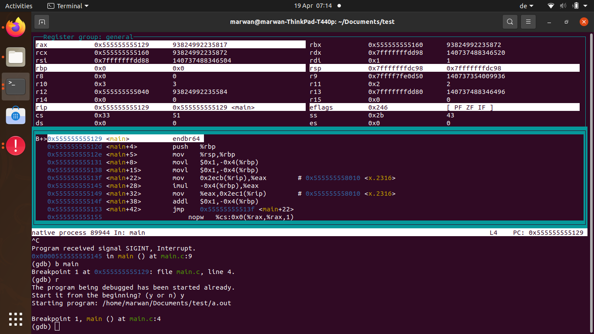

### gdb

Add debugging data into the binary, this helps not to setp-in into unnecessary code
`g++ <source-file> -g`

Choose the parent process to debug
`set follow-fork-mode child`

Choose the other program that runs in the child to debug
`set follow-exec-mode new`

Jump to the moment your system crashed and generated the coredump, debugging information shall be enabled in compilation
`gdb ./a.out core`

* show layout registers `lay r`

* starts single stepping at the first instruction (saves having to set a breakpoint) `starti`
* single stepping instructions in assembly `si` and `ni`
* displays floating point registers `tui reg float`

* start the program (run) `r`
* step line by line (step) `s`
* step over a function (next) `n`
* continue till the next breakpoint or watch point (continue) `c`
* repeat the last command `press enter`
* exit the gdb `quit`

* add a breakpoint (break) `b <function or filename:line number>`
* clear breakpoint `clear <function or line number>`
* ignore and count breakpoint hits `ignore <breakpoint id number>`
* watch for variable changes `watch <global variable>`
* print variable `p <variable>`

* show a local variable `info variables <variable>`
* show local variables `info locals`
* show all variables `info variables`
* show all breakpoints and relative statistics `info breakpoint`

* list code associated with this variable `li`
* show stack frames, the current frame has value of 0 `fr <frame number (optional)>`
* show call stack (backtrace) `bt`
* examine memory by address or by symbol if -g was used `x/<number><format o|h|d|...><size b|h|w|g><address or symbol>`, `help x`

